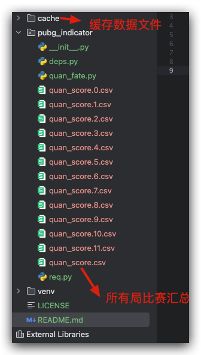

PUBG指标量化脚本

[quan_fate.py](pubg_indicator%2Fquan_fate.py)  圈运量化
跟进自己的实际情况 更新
[deps.py](pubg_indicator%2Fdeps.py) 
PROJ_DIR = '项目根目录， 以pubg-indicator 结尾  例如 /Users/***/PycharmProjects/pubg-indicator'
api_key = 'pubg api key 来自 https://documentation.pubg.com/en/introduction.html 注册账号申请'

